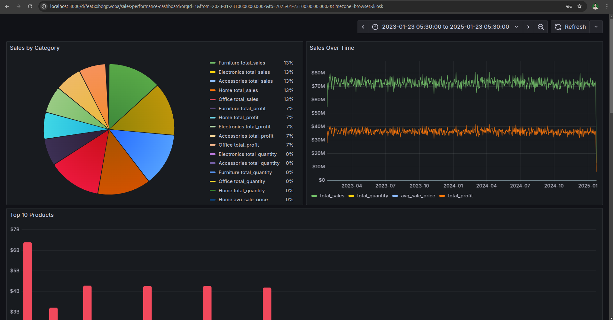

# Sales Performance Dashboard

This is a Grafana dashboard for monitoring sales performance. It provides insights into total revenue, sales trends, top products, and more.

## Dashboard Overview

## Features
- **Total Revenue**: Displays the total revenue generated over time.
- **Sales Trends**: Visualizes daily, weekly, and monthly sales trends.
- **Top Products**: Highlights the top-selling products by revenue.
- **Profit Analysis**: Tracks profit generated by category and product.

## How to Use
1. Clone this repository.
2. Set up Grafana and PostgreSQL using Docker.
3. Import the dashboard JSON file into Grafana.
4. Start analyzing your sales data!

## License
This project is licensed under the MIT License. See the [LICENSE](LICENSE) file for details.